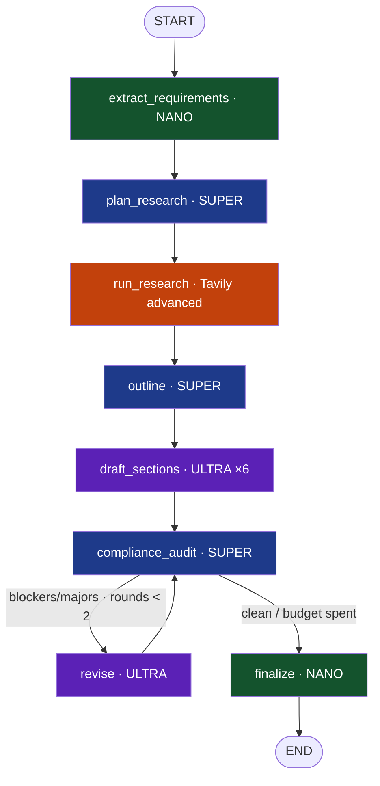

<div align="center">


# ARCHIMEDES

**Win grants, not paperwork.**

An autonomous grant-writing agent for non-profits, university researchers, and
startups. Upload a solicitation and your organization profile — Archimedes
extracts every requirement, researches the live web, drafts the complete
proposal with real citations, audits it for compliance, rewrites what fails,
and hands you an export-ready document.

Grant writers cost \$100–200/hour. Archimedes costs a few cents of API credit.

*Built for the **Nebius × NVIDIA Global AI Hackathon** — Best Apps & Agents Track*

[](../../actions/workflows/ci.yml)

`NVIDIA Nemotron on Nebius Token Factory` · `LangGraph` · `Tavily` · `Supabase` · `FastAPI` · `Next.js 14` · `Nebius Serverless`

**Quick links:** [10-minute Quickstart](#-10-minute-quickstart) · [Demo without credits](#-demo-without-any-credits) · [Architecture](#%EF%B8%8F-architecture) · [How we use Nebius & NVIDIA](#-how-we-use-nebius-token-factory--nvidia-nemotron) · [How we use Tavily](#-how-we-use-tavily) · [Deployment](docs/DEPLOYMENT.md) · [PRD](docs/PRD.md)

</div>

---

## The problem

A competitive grant proposal takes 40–120 hours of skilled work. Small
non-profits and first-time research teams — the organizations that most need
funding — can't pay $100–200/hour for grant writers, so they lose grants to
avoidable compliance mistakes: a missed page limit, an unaddressed review
criterion, a missing mandatory section.

Archimedes turns grant writing into a **verifiable agent pipeline**, not a
chat window.

## What it does

| Stage | What happens | Who does it |
|---|---|---|
| 📄 **Extract** | Every requirement (deadline, budget cap, eligibility, sections + page limits, formatting, review criteria) with verbatim source quotes | Nemotron **Nano** |
| 🔎 **Research** | 4–8 targeted Tavily searches planned per section; findings stored with URLs | Nemotron **Super** + Tavily |
| ✍️ **Draft** | Every required section, sized to page limits, inline `[n]` citations from fetched sources only | Nemotron **Ultra** |
| 🛡️ **Audit** | Draft scored against every mandatory rule: `100 − blockers·25 − majors·10 − minors·3` | Nemotron **Super** |
| 🔁 **Revise** | Sections with blocker/major issues rewritten with the fixes (max 2 rounds) | Nemotron **Ultra** |
| 📦 **Finalize** | Title, 150-word abstract, TOC, references; export to MD/DOCX/PDF | Nemotron **Nano** + exporter |

You watch it all live: a terminal-style agent trace with a colored badge per
call (**Nano** green · **Super** blue · **Ultra** purple · **Tavily** orange),
tokens, latency, estimated cost, and a live progress bar.

## ⚡ 10-minute quickstart

```bash
# 1 · clone + install (python venv + pnpm) + create .env
git clone <your-fork> archimedes && cd archimedes
make setup

# 2 · add keys to .env  (free tiers / hackathon credits)
#      NEBIUS_API_KEY      → https://studio.nebius.com
#      TAVILY_API_KEY      → https://app.tavily.com
#      SUPABASE_*          → https://supabase.com  (run supabase/migrations/0001_init.sql
#                            in the SQL editor; see docs/DEPLOYMENT.md §2)

# 3 · run the stack
make dev              # docker compose: api :8000 · worker · web :3000
#    or bare-metal:   make api  +  make worker  +  make web

# 4 · verify
curl localhost:8000/health
make smoke            # 9-check smoke test (offline; --live URL probes a running stack)
```

Full step-by-step (Supabase provisioning, OAuth, Vercel, Nebius Serverless):
**[docs/DEPLOYMENT.md](docs/DEPLOYMENT.md)**.

## 🎬 Demo without any credits

Three ways, all offline:

```bash
make demo                       # full agent pipeline in your terminal, live trace
make test                       # 147 tests incl. full-graph integration
make seed-demo                  # seed the demo project into Supabase for the web UI
```

…or set `MOCK_LLM=true`, sign in, and press **Try the demo project** — the
whole product (extraction → research → drafting → audit → revision → export)
runs on deterministic fixtures. Mock citations use `mock.tavily.local` so they
can never be mistaken for live research.

With credits, `worker/main.py --demo --live` runs the same bundled mock
solicitation against real Nemotron + Tavily.

## 🏗️ How we use Nebius Token Factory & NVIDIA Nemotron

**All** LLM inference goes through the Nebius Token Factory
(`https://api.studio.nebius.com/v1/`, OpenAI-compatible) on **NVIDIA
open-source Nemotron models**. Model ids are env vars — swap in newer catalog
entries without touching code.

| Task | Tier | Default model | Why |
|---|---|---|---|
| Requirement extraction (per chunk) | **Nano** | `Llama-3_1-Nemotron-Nano-8B` | High-volume structured JSON at temp 0 — cheapest model that does it perfectly |
| Research planning · outline · compliance audit | **Super** | `Llama-3_3-Nemotron-Super-49B` | Whole-draft judgment; short structured outputs; stable audit scores |
| Section drafting · revision | **Ultra** | `Llama-3_1-Nemotron-Ultra-253B` | The only output humans read as prose; <30% of calls, >85% of tokens — spend where it shows |
| Title/abstract · tighten · project chat | **Nano** | `Llama-3_1-Nemotron-Nano-8B` | Compression & grounded Q&A — no reason to pay Ultra prices |

The `ModelRouter` (`services/api/app/services/nebius_client.py`) maps task →
tier, enforces per-tier temperature/max-tokens, retries 429/5xx with backoff,
and **logs every call** (model, tokens in/out, latency, estimated cost) to
`job_events` — the UI's Model Router panel is that log, live. Nemotron's
`<think>` reasoning blocks are stripped before parsing; JSON is repaired
through a tested escalation ladder. Details:
[docs/NEBIUS_NVIDIA_USAGE.md](docs/NEBIUS_NVIDIA_USAGE.md).

## 🔎 How we use Tavily

The `plan_research` node (Super) turns extracted requirements into 4–8
specific queries with rationale and target sections; `run_research` executes
them on the Tavily Search API (`search_depth="advanced"`, concurrency 4).
Findings are stored **only** from what Tavily actually returned — the drafting
node cites `[n]` exclusively against that numbering, and the reference list is
built from the same list. No fabricated citations, by construction.

## ☁️ How we use Nebius Serverless

The same worker container runs three ways: **Nebius Serverless Job** (one
containerized run per proposal, `JOB_ID` injected), a **polling claim-loop
container**, or a **local subprocess** spawned by the API (`LOCAL_WORKER_MODE=true`
— the laptop path). The FastAPI image deploys to a Nebius Serverless Endpoint,
with Render.com documented as a fallback. Job progress streams to the browser
through Supabase Realtime either way. See [docs/DEPLOYMENT.md](docs/DEPLOYMENT.md).

## 🏛️ Architecture



LangGraph owns the loop — 8 pure nodes over a typed `ProposalState`, routing
in one function. FastAPI (Pydantic v2) + Supabase Postgres with RLS on every
table; Next.js 14 (App Router, TypeScript strict, Tailwind) in front, live via
Supabase Realtime + SSE. Full diagrams and the data flow:
[docs/ARCHITECTURE.md](docs/ARCHITECTURE.md).

## Repository map

```
archimedes/
├── apps/web/            Next.js 14 App Router (TS strict · Tailwind · shadcn-style ui)
│   ├── app/             landing · (auth)/login · dashboard · dashboard/new · [projectId]
│   ├── components/      ui kit + {requirements,agent,editor,compliance,export,layout,auth}
│   ├── lib/             api client (typed + SSE) · supabase clients · types (mirrors API)
│   └── middleware.ts    session refresh + /dashboard guard
├── services/api/        FastAPI + LangGraph + worker (shared package)
│   ├── app/routers/     projects · documents · jobs · chat(SSE) · export · health
│   ├── app/services/    nebius_client (ModelRouter+stream) · tavily · parser · storage · job_launcher · exporter
│   ├── app/auth.py      Supabase JWT verification (HS256 / JWKS)
│   ├── app/agent/       state · graph · nodes/ · prompts/ · fixtures · reporter
│   ├── worker/main.py   one entrypoint: JOB_ID | --poll | --demo
│   ├── Dockerfile(.worker)  api + worker images (docker compose / Nebius Jobs)
│   └── tests/           147 offline tests (MOCK_LLM fixtures)
├── supabase/            0001_init.sql (RLS + realtime + storage) · seed.sql
├── docs/                PRD · ARCHITECTURE · API · SECURITY · DEPLOYMENT ·
│                        DEMO_SCRIPT · NEBIUS_NVIDIA_USAGE
└── scripts/             setup.sh · demo_seed.py · smoke_test.py
```

## Environment variables

| Variable | Used by | Purpose |
|---|---|---|
| `NEBIUS_API_KEY` | api, worker | Nebius Token Factory auth — all LLM calls |
| `NEBIUS_BASE_URL` | api, worker | default `https://api.studio.nebius.com/v1/` |
| `NEMOTRON_NANO_MODEL` / `_SUPER_` / `_ULTRA_` | api, worker | model ids — confirm in the Token Factory catalog |
| `TAVILY_API_KEY` | api, worker | live web research |
| `SUPABASE_URL` / `SUPABASE_ANON_KEY` / `SUPABASE_SERVICE_ROLE_KEY` | api, worker | Postgres/Storage/Realtime (service role server-side only) |
| `NEXT_PUBLIC_SUPABASE_URL` / `NEXT_PUBLIC_SUPABASE_ANON_KEY` | web | browser auth + realtime |
| `NEXT_PUBLIC_API_URL` | web | FastAPI base URL |
| `LOCAL_WORKER_MODE` | api | `true`: spawn worker subprocess per job |
| `NEBIUS_SERVERLESS_ENABLED` / `_JOB_IMAGE` / `NEBIUS_PROJECT_ID` / `NEBIUS_JOBS_API_URL` | api | submit jobs to Nebius Serverless instead |
| `SUPABASE_JWT_SECRET` | api | verifies Supabase JWTs (HS256) — or leave empty to use Supabase JWKS |
| `MOCK_LLM` | api, worker | deterministic offline fixtures |

## Make targets

`make setup` · `make dev` · `make api` · `make worker` · `make web` ·
`make demo` · `make test` · `make lint` · `make format` · `make migrate` ·
`make seed-sql` · `make seed-demo` · `make smoke` · `make build-images` ·
`make help`

## Hackathon track statement

**Best Apps and Agents Track.** Archimedes is both: an *app* a small non-profit
can use today, and an *agent* — a LangGraph pipeline with tools (Tavily), a
model router across three NVIDIA Nemotron tiers on Nebius Token Factory, a
self-audit/revise loop, and long-running execution on Nebius Serverless Jobs
with live streaming. Everything is MIT-licensed; the demo runs offline.

## License

MIT — see [LICENSE](LICENSE).
