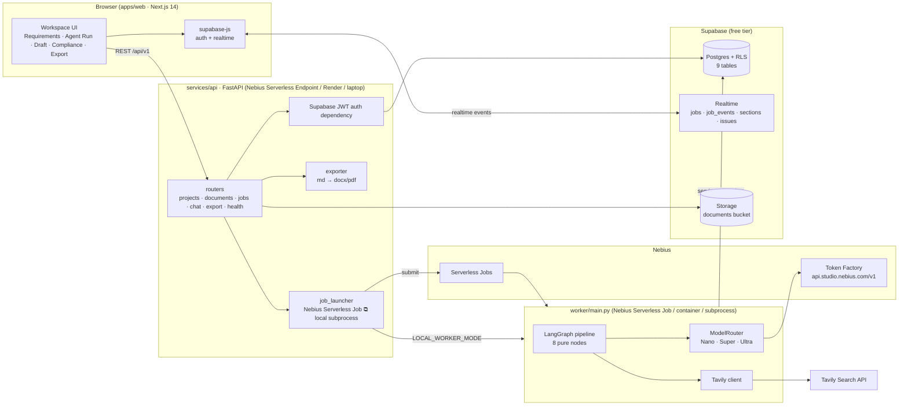
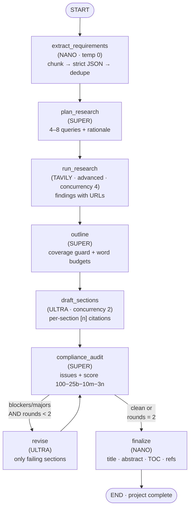

# ARCHIMEDES — Architecture

Three runtime processes, one shared database, one agent graph.

## The agent pipeline

Routing decisions live in one table (`TASK_ROUTES` in
`services/nebius_client.py`); the conditional edge is one pure function
(`route_after_audit` in `app/agent/graph.py`). Nothing else in the codebase
decides which model runs.

## Data flow of one run

1. `POST /projects/{id}/run` creates a `jobs` row (`status=queued`,
   `runtime=nebius_serverless|local`) and launches the worker.
2. The worker claims/runs the job and executes the graph. Every side effect
   goes through a `RunReporter`:
   - `job_events` rows (level info/model/tool/warn/error) → Agent Run console,
   - `jobs.progress` + `current_step` + `projects.status` → progress bar,
   - `requirements`, `research_findings`, `sections`, `compliance_issues`
     written **as produced**, so tabs fill in live,
   - `projects.compliance_score`, `title`, `abstract` at finalize.
3. The browser subscribes via Supabase Realtime to `jobs`, `job_events`,
   `sections`, `compliance_issues` (filtered by the user's RLS-visible
   project); `GET /jobs/{id}/events?since=` is the polling fallback.

## Worker execution modes (one container, three ways)

| Mode | Trigger | Mechanism |
|---|---|---|
| **Local subprocess** (`LOCAL_WORKER_MODE=true`) | API on your laptop | API spawns `python worker/main.py` with `JOB_ID` env per job |
| **Polling container** (docker compose `worker` / `make worker`) | always-on | `python worker/main.py --poll` atomically claims queued jobs (`UPDATE … WHERE status='queued' … RETURNING` CAS — safe with N workers) |
| **Nebius Serverless Job** (`NEBIUS_SERVERLESS_ENABLED=true`) | production | API submits the job to Nebius with the worker image; Nebius runs `python worker/main.py` with `JOB_ID` |

All three run the *same* code path (`run_pipeline`), so a demo on a laptop and
a run on Nebius behave identically.

## State & typing

`ProposalState` (TypedDict, `app/agent/state.py`) is the single state shape;
nodes are pure functions returning partial updates. The only non-JSON field is
`ctx` (live objects: settings, router, tavily, reporter) — LangGraph passes
object references through, so no node touches globals.

Pydantic models (`app/models/schemas.py`) mirror the SQL schema 1:1 and are
mirrored again in `apps/web/lib/types.ts` for the frontend.

## Security model

- **RLS everywhere**: `auth.uid()`-scoped policies on all 9 tables; child rows
  scoped via `projects` joins (validated with role-playback SQL probes during
  development).
- **Service role** (`SUPABASE_SERVICE_ROLE_KEY`) exists only in the API/worker
  processes; it bypasses RLS by design and is the only cross-user write path.
- **Browser** talks to (a) Supabase directly with the anon key (auth,
  realtime), and (b) FastAPI with the user's JWT, verified server-side.
- **Storage**: private `documents` bucket; per-user folders enforced by
  `storage.objects` policies (`(storage.foldername(name))[1] = auth.uid()`).

## Failure handling

| Failure | Behavior |
|---|---|
| One extraction chunk unparseable | warn event, chunk skipped, coverage re-checked at audit |
| Extraction JSON hopeless | `repair_json` escalation ladder (fences → balanced block → commas → quotes → control chars → single quotes) |
| Tavily query fails | try/except per query, warn event, run continues |
| Model call 429/5xx/timeout | tenacity exponential backoff (4 attempts), then node raises |
| Node raises | pipeline traced (`error` event), job marked `failed` with the error, project status `failed`, worker exit code 1 |
| Worker dies mid-run | job stays `running` (visible in the UI as such) until a manual re-run; re-runs are idempotent — requirements/issues/sections are replaced wholesale |

## Cost of a live run (order of magnitude)

~15–25 model calls per proposal: 6–14 Nano (extraction chunks, finalize),
3–5 Super (planning, outline, audits), 6–10 Ultra (draft + revise). Drafting is
<30% of calls but >85% of tokens — which is why the router exists. Every call
logs `tokens_in/out`, `latency_ms`, and `estimated_cost_usd` to `job_events`;
the Agent Run console shows each cost inline as it happens.

## HTTP surface & frontend wiring

The API exposes 14 routes under `/api/v1` (full reference with curl examples:
[API.md](API.md)): projects CRUD + aggregate, documents (upload/URL),
jobs (run/status/events), section PATCH, one-click compliance fix, SSE chat,
md/docx/pdf export, health. Every route verifies the caller's Supabase JWT
(`app/auth.py`) and scopes access with `require_project` — a foreign resource
is a 404, never a 403.

The browser never reads project tables directly: `apps/web/lib/api.ts` is the
single typed client (mirrors of the Pydantic models live in `lib/types.ts`).
Supabase is used from the browser only for **auth** (anon key) and
**Realtime** postgres_changes on `jobs`/`job_events`/`sections`/
`compliance_issues`; each broadcast triggers an aggregate refetch, and a 4 s
poll of the active job backs it up while a run is in flight. The chat
assistant consumes the API's SSE stream directly (Nano classifies → optional
Tavily round → Super streams the grounded answer).
